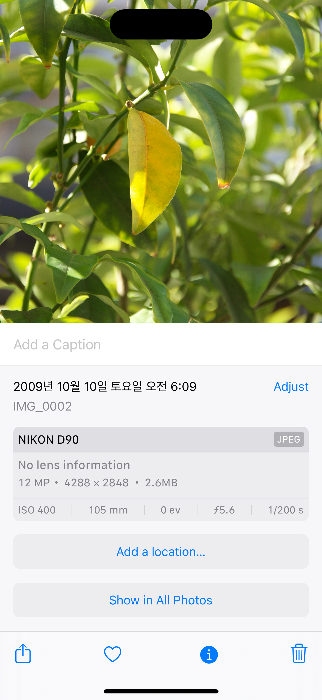
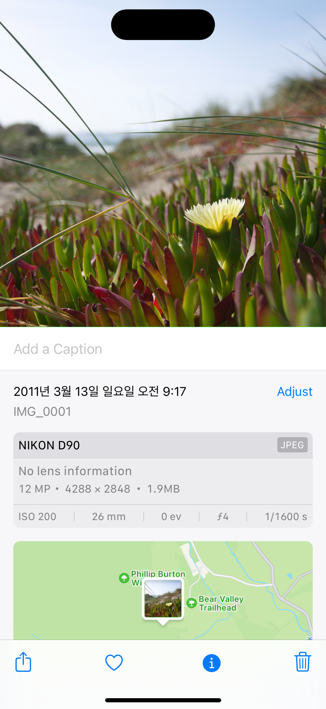
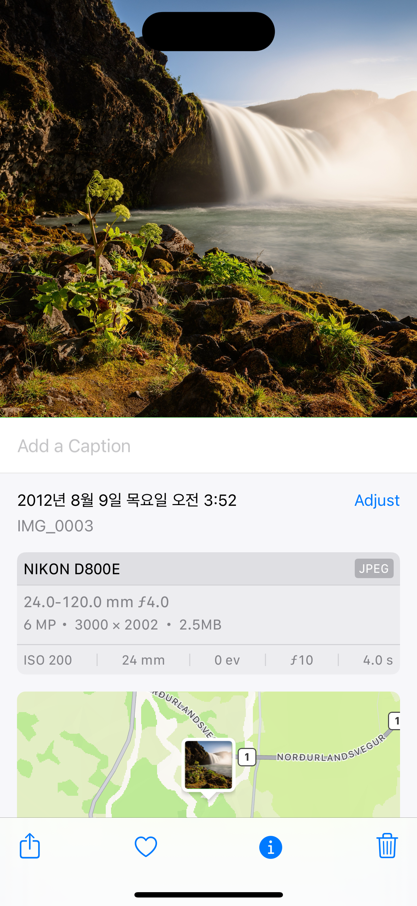
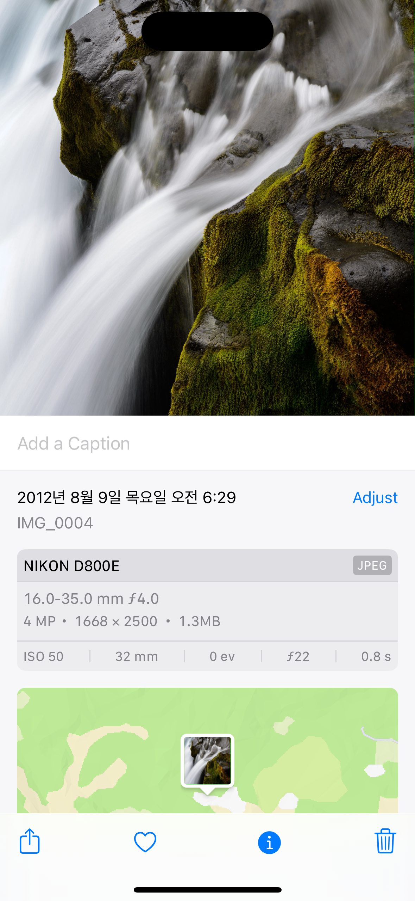
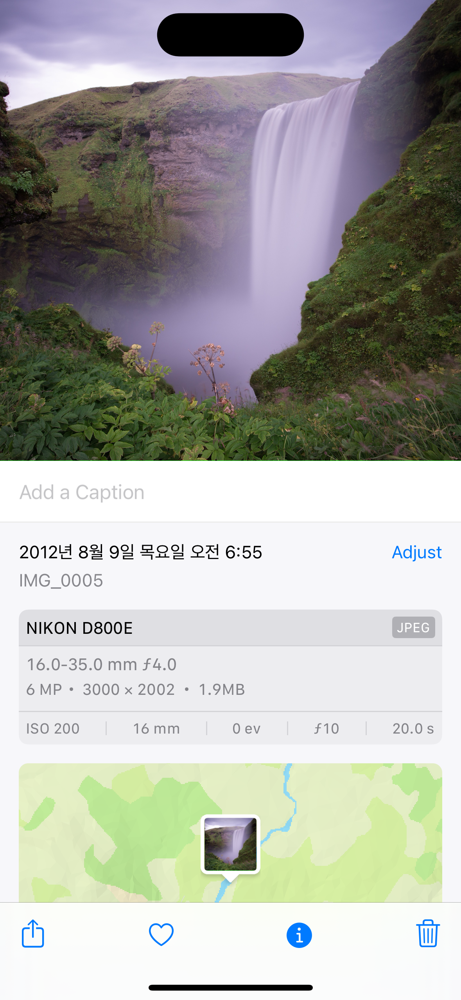
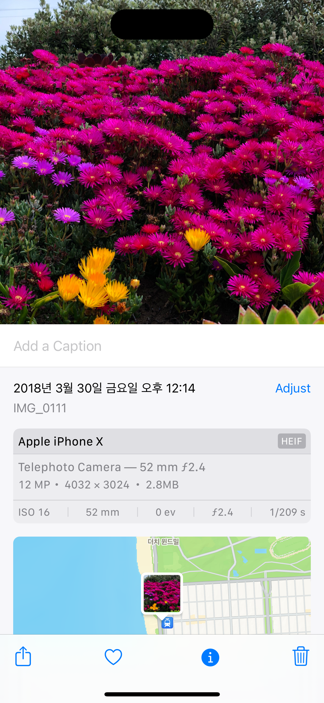
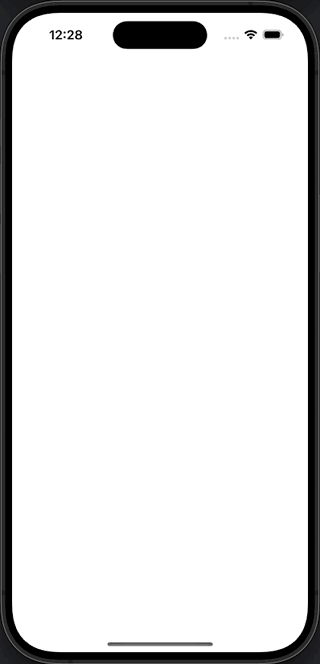
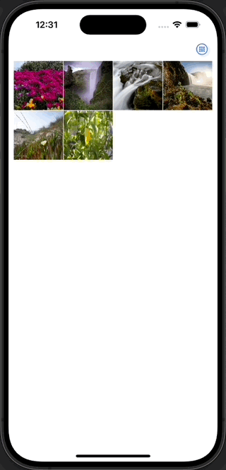
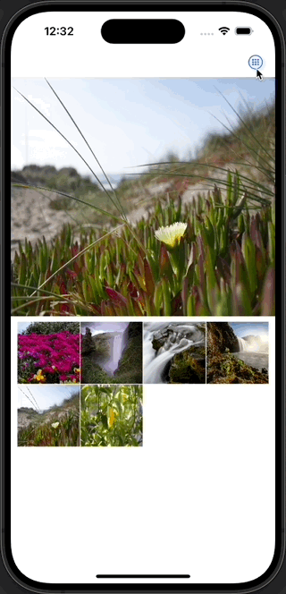
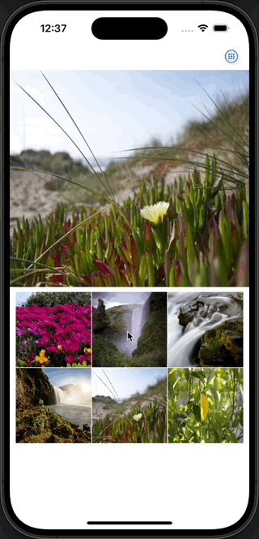

# SwiftUI 포토갤러리

### 🔢 목차
- [SwiftUI 포토갤러리](#swiftui-포토갤러리)
    - [🔢 목차](#-목차)
    - [🛠️ 개발 환경](#️-개발-환경)
    - [🏞️ 사용된 이미지](#️-사용된-이미지)
    - [🎥 실행 화면](#-실행-화면)
    - [🔗 참고 링크](#-참고-링크)

---

### 🛠️ 개발 환경
|XCode Version|Deployment Target|UI Framwork|
|:-:|:-:|:-:|
|15.0.1 (15A507)|iOS 17.0+|SwiftUI|

---

### 🏞️ 사용된 이미지
- 2009~2018년 까지 6개의 이미지 

---

### 🎥 실행 화면
|사진 권한 확인|선택 미리보기|
|:-:|:-:|
|||
|격자뷰 갯수 변경|스크롤|
|||

---

### 🔗 참고 링크
- [ Developer Apple - PhotoKit](https://developer.apple.com/documentation/photokit)
- [ Developer Apple - NSSortDescriptor](https://developer.apple.com/documentation/foundation/nssortdescriptor)
- [ Developer Apple - PHImageManagerMaximumSize](https://developer.apple.com/documentation/photokit/phimagemanagermaximumsize)
- [ Developer Apple - GeometryReader](https://developer.apple.com/documentation/swiftui/geometryreader)
- [🌐블로그 - PhotoKit (2) - 미디어 가져오기](https://zeddios.tistory.com/620)
- [🌐블로그 - PHImageRequestOptions 프로퍼티 살펴보기](https://zeddios.tistory.com/1151)
- [🌐블로그 - SwiftUI : AspectRatio / GeometryReader / GeometryProxy](https://seons-dev.tistory.com/entry/AspectRatio-GeometryReader)
